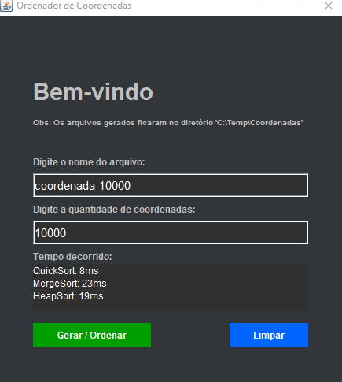

# Ordenador De Dados
Atividades Práticas Supervisionadas - 4ºSemestre UNIP

Os algoritmos utilizados foram: **Quicksort, Mergesort e Heapsort**.    
O sistema gera uma determinada quantidade de coordenadas definida pelo usuário. Os dados são gerados e    
são ordenados por cada um dos algoritmos. O tempo de execução da ordenação é exibido no final do processo.   
Os arquivos são gerados no diretório a seguir:   
      C:\Temp\Coordenadas

## Descrição da Atividade Proposta

1) O grupo de alunos deverá realizar um trabalho utilizando algoritmos
considerando o seguinte exemplo: o geoprocessamento de imagens da floresta
amazônica permite a fiscalização de ações de crimes ambientais. Os satélites
geram cerca de 100 mil imagens de toda a região a cada 24 horas, essas
imagens são armazenadas o catalogadas.

2) O grupo deverá selecionar três ou mais técnicas e desenvolver um sistema
computacional completo que obtenha os dados catalogados das imagens
capturadas dos satélites, efetue a ordenação e compare os desempenhos entre
eles. A unidade de medida para efeito de comparação deverá ser o tempo total
de ordenação. Não deverá ser contabilizado o tempo de aquisição dos dados,
apenas o processo específico de ordenação.

3) Os dados que serão utilizados para as ordenações deverão ser externos
(obtidos a partir de valores previamente armazenados, tais como arquivos
texto) e internos (valores aleatórios gerados pelo próprio programa ou
fornecidos diretamente pelo usuário).

4) O sistema computacional deverá ser desenvolvido utilizando a linguagem de
programação Java.

